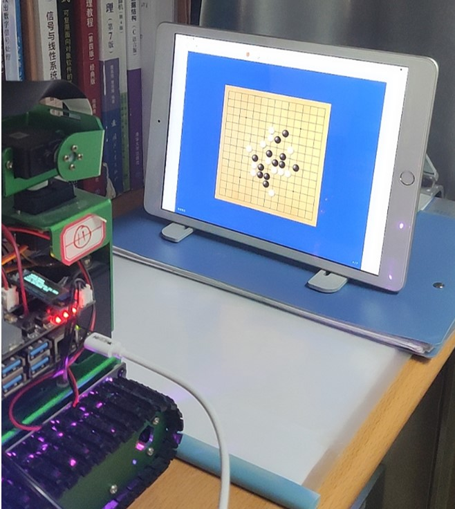
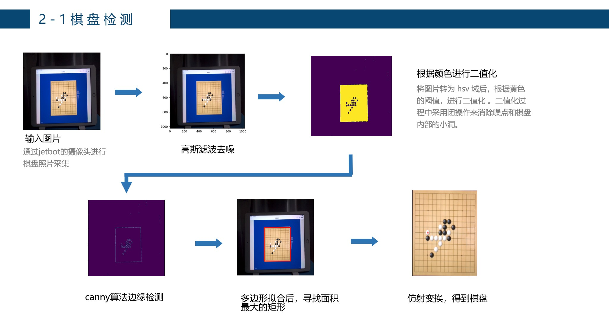
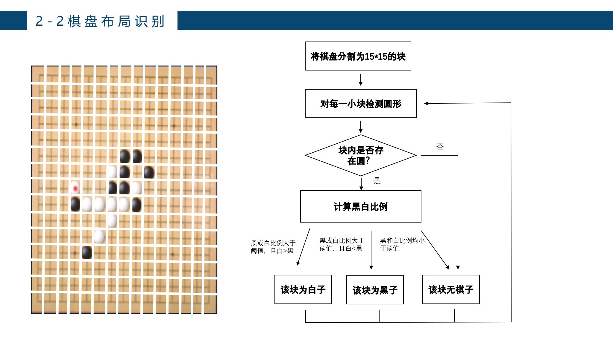
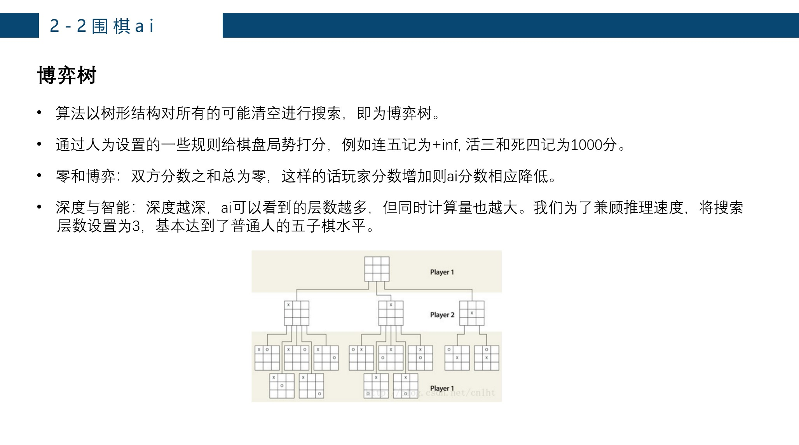
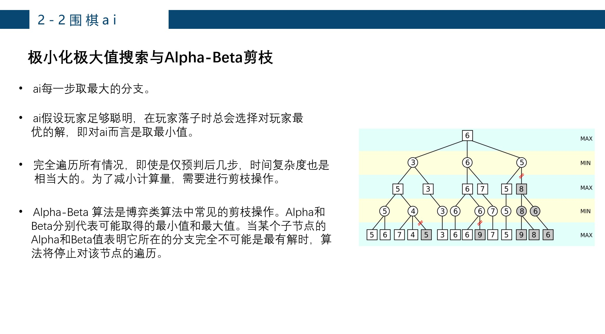
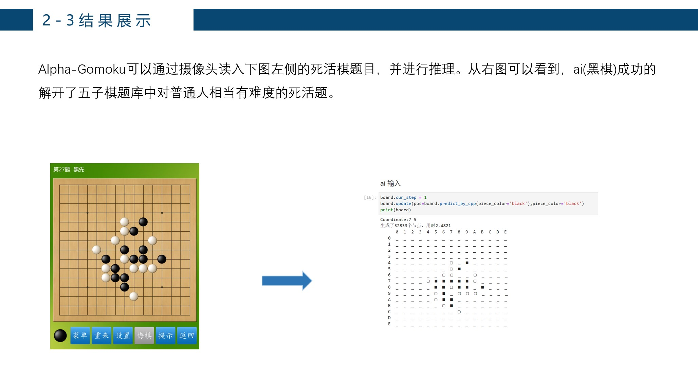

# Checkerboard_scanner

五子棋棋盘扫描和ai预测
<br/>
<br/>
## 1. 基本功能

本次项目基于jetbot平台，设计了围棋aiAlpha-Gomoku。Alpha-Gomoku 可以通过摄像头对棋盘进行扫描，从而获得棋盘的布局，并基于特地的算法进行预测。我们希望该产品能帮助五子棋选手进行练习，提高棋艺，也可供围棋爱好者日常弈棋娱乐之用。
   

 <br/>
 <br/>
 
## 2. 算法介绍
 <br/>

 <br/>
 <br/>

<br/>
<br/>

<br/>
<br/>

<br/>
<br/> 

<br/>
<br/> 

> 参考：
>
> [colingogogo/gobang_AI: 基于博弈树α-β剪枝搜索的五子棋AI (github.com)](https://github.com/colingogogo/gobang_AI#gobang_ai)
>
> [lihongxun945/gobang: javascript gobang AI，JS五子棋AI，源码+教程，基于Alpha-Beta剪枝算法（不是神经网络） (github.com)](https://github.com/lihongxun945/gobang)
>
> [HaloOrangeWang/PythonGomoku: 使用Python制作的五子棋游戏 (github.com)](https://github.com/HaloOrangeWang/PythonGomoku)


## 3. 安装

库要求见requirements.txt。注意需要部署`board_scannner/cpp`下的文件。c++代码来源于：https://github.com/cyanlink/PythonGomoku

### 部署cpp ai模块

进入`board_scannner/cpp`目录，运行 

```
python setup.py build
python setup.py install
```

之后使用

```
pip show example
```

查看是否安装成功


## 4. 其他说明

- 本项目考虑到部署在nano平台上，未使用交互式的围棋棋盘。如果有需要可参考上述链接中的教程，使用PyQt制作交互式的围棋棋盘。


